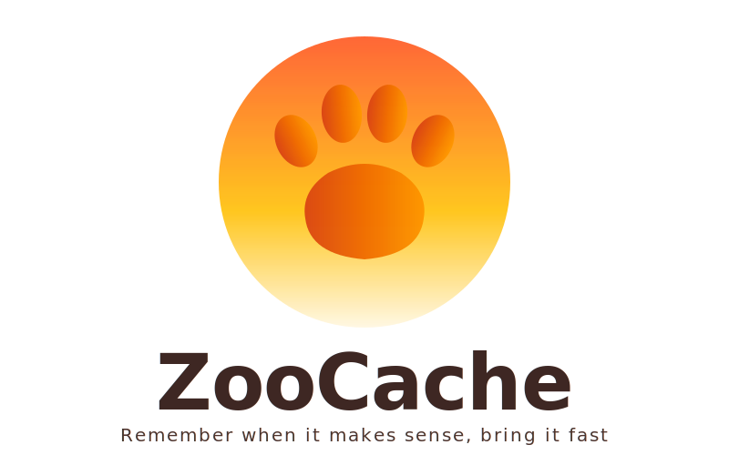

<p align="center">
  <picture>
    <source media="(prefers-color-scheme: dark)" srcset="assets/logo-dark.svg">
    <source media="(prefers-color-scheme: light)" srcset="assets/logo-light.svg">
    
  </picture>
</p>

<p align="center">
  Zoocache is a high-performance caching library with a Rust core, designed for applications where data consistency and read performance are critical.
</p>
<div align="center" markdown="1">

[**📖 Read the User Guide**](user_guide.md)

</div>
<p align="center">
  <a href="https://www.python.org/downloads/"></a>
  <a href="https://opensource.org/licenses/MIT"></a>
  <a href="https://pypi.org/project/zoocache/"></a>
  <a href="https://pypi.org/project/zoocache/"></a>
  <a href="https://github.com/albertobadia/zoocache/actions/workflows/ci.yml"></a>
  <a href="https://zoocache.readthedocs.io/"></a>
</p>

---

## ✨ Key Features

- 🚀 **Rust-Powered Performance**: Core logic implemented in Rust for ultra-low latency and safe concurrency.
- 🧠 **Semantic Invalidation**: Use a `PrefixTrie` for hierarchical invalidation. Clear "user:*" to invalidate all keys related to a specific user instantly.
- 🛡️ **Causal Consistency**: Built-in support for Hybrid Logical Clocks (HLC) ensures consistency even in distributed systems.
- ⚡ **Anti-Avalanche (SingleFlight)**: Protects your backend from "thundering herd" effects by coalescing concurrent identical requests.
- 📦 **Smart Serialization**: Transparently handles MsgPack and LZ4 compression for maximum throughput and minimum storage.
- 🔄 **Self-Healing Distributed Cache**: Automatic synchronization via Redis Bus with robust error recovery.

---

## ⚡ Quick Start

### Installation

Using `pip`:
```bash
pip install zoocache
```

Using `uv` (recommended):
```bash
uv add zoocache
```

### Simple Usage

```python
from zoocache import cacheable, invalidate

@cacheable(deps=lambda user_id: [f"user:{user_id}"])
def get_user(user_id: int):
    return db.fetch_user(user_id)

def update_user(user_id: int, data: dict):
    db.save(user_id, data)
    invalidate(f"user:{user_id}")  # All cached 'get_user' calls for this ID die instantly
```

### Complex Dependencies

```python
from zoocache import cacheable, add_deps

@cacheable
def get_product_page(product_id: int, store_id: int):
    # This page stays cached as long as none of these change:
    add_deps([
        f"prod:{product_id}",
        f"store:{store_id}:inv",
        f"region:eu:pricing",
        "campaign:blackfriday"
    ])
    return render_page(product_id, store_id)

# Any of these will invalidate the page:
# invalidate("prod:42")
# invalidate("store:1:inv")
# invalidate("region:eu") -> Clears ALL prices in that region
```

---

## 📖 Documentation

Explore the deep dives into Zoocache's architecture and features:

- [**Architecture Overview**](architecture.md) - How the Rust core and Python wrapper interact.
- [**Hierarchical Invalidation**](invalidation.md) - Deep dive into the PrefixTrie and O(D) invalidation.
- [**Serialization Pipeline**](serialization.md) - Efficient data handling with MsgPack and LZ4.
- [**Concurrency & SingleFlight**](concurrency.md) - Shielding your database from traffic spikes.
- [**Distributed Consistency**](consistency.md) - HLC, Redis Bus, and robust consistency models.
- [**Reliability & Edge Cases**](reliability.md) - Fail-fast mechanisms and memory management.

---

## ⚖️ Comparison

| Feature | **🐾 Zoocache** | **🔴 Redis (Raw)** | **🐶 Dogpile** | **diskcache** |
| :--- | :--- | :--- | :--- | :--- |
| **Invalidation** | 🧠 **Semantic (Trie)** | 🔧 Manual | 🔧 Manual | ⏳ TTL |
| **Consistency** | 🛡️ **Causal (HLC)** | ❌ Eventual | ❌ No | ❌ No |
| **Anti-Avalanche** | ✅ **Native** | ❌ No | ✅ Yes (Locks) | ❌ No |
| **Performance** | 🚀 **Very High** | 🏎️ High | 🐢 Medium | 🐢 Medium |

---

## 📊 Performance Benchmarks

<div align="center" markdown="1">

[](main/bench/)

</div>

[View Detailed Benchmark Results](main/bench/)

---

## ❓ When to Use Zoocache

### ✅ Good Fit
- **Complex Data Relationships:** Use dependencies to invalidate groups of data.
- **High Read/Write Ratio:** Where TTL causes stale data or unnecessary cache churn.
- **Distributed Systems:** Native Redis Pub/Sub invalidation and HLC consistency.
- **Strict Consistency:** When users must see updates immediately (e.g., pricing, inventory).

### ❌ Not Ideal
- **Pure Time-Based Expiry:** If you only need simple TTL for session tokens.
- **Simple Key-Value:** If you don't need dependencies or hierarchical invalidation.
- **Minimal Dependencies:** For small, local-only apps where basic `lru_cache` suffices.

---

## 📄 License

This project is licensed under the MIT License - see the [LICENSE](https://github.com/albertobadia/zoocache/blob/main/LICENSE) file for details.
