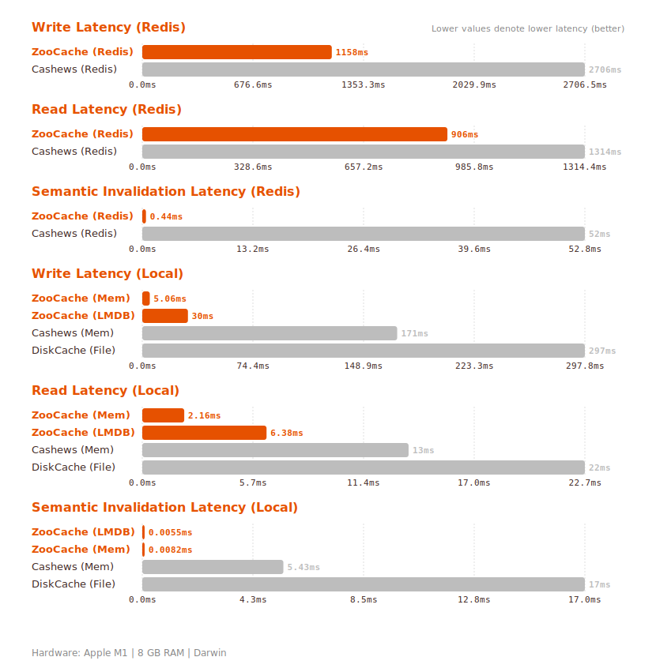

<p align="center">
  <picture>
    <source media="(prefers-color-scheme: dark)" srcset="assets/logo-dark.svg">
    <source media="(prefers-color-scheme: light)" srcset="assets/logo-light.svg">
    
  </picture>
</p>

<p align="center" markdown>
**ZooCache** is a high-performance caching library with a Rust core, designed for applications where data consistency and read performance are critical.
</p>

---

## Start in 30 Seconds

```python
# Install
uv add zoocache

# Use
from zoocache import cacheable, invalidate, configure, add_deps

configure()  # Must configure first!

@cacheable()
def get_user(uid):
    add_deps([f"user:{uid}"])
    return db.fetch_user(uid)  # Runs once

get_user(1)  # Database
get_user(1)  # Cache - instant

invalidate("user:1")  # Invalidate instantly
```

[→ Full Quick Start](setup.md)

---

## What Problem Does ZooCache Solve?

Traditional caches use **TTL** (Time To Live), which creates problems:

| Problem | Description |
|---------|-------------|
| **Stale Data** | Users see old data until TTL expires |
| **Cache Thrashing** | Data expires, all requests hit DB simultaneously |
| **Manual Invalidation** | You must track and invalidate every key manually |

**ZooCache** uses **Semantic Invalidation** — invalidate exactly what changed, instantly, using hierarchical dependencies.

---

## Key Features

- 🧠 **Semantic Invalidation** — Use a PrefixTrie for hierarchical invalidation. Clear `"user:*"` to invalidate all keys related to a specific user instantly.

- 🚀 **Rust-Powered Performance** — Core logic implemented in Rust for ultra-low latency and safe concurrency.

- 🛡️ **Causal Consistency** — Built-in support for Hybrid Logical Clocks (HLC) ensures consistency even in distributed systems.

- ⚡ **Anti-Avalanche** — Protects your backend from "thundering herd" effects by coalescing concurrent identical requests.

- 🔄 **Self-Healing** — Automatic synchronization via Redis Bus with robust error recovery.

- 📊 **Observability** — Built-in support for Logs, Prometheus, and OpenTelemetry.

---

## Why ZooCache?

| Feature | **🐾 ZooCache** | **🔴 Redis** | **🐶 Dogpile** | **diskcache** |
|---------|:---------------:|:------------:|:-------------:|:-------------:|
| **Semantic Invalidation** | ✅ Trie-based | ❌ Manual | ❌ Manual | ❌ TTL only |
| **Causal Consistency** | ✅ HLC | ❌ Eventual | ❌ No | ❌ No |
| **Anti-Avalanche** | ✅ Native | ❌ No | ✅ Locks | ❌ No |
| **Rust-powered** | ✅ Core | ❌ No | ❌ No | ❌ No |

---

## Choose Your Path

### 🆕 I'm New
Learn ZooCache from scratch with our step-by-step tutorial.

[→ Getting Started](setup.md)

### ⚡ I'm in a Hurry
Just show me the code I can copy-paste.

[→ Quick Examples](#start-in-30-seconds)

### 🌐 I Use FastAPI
Cache FastAPI endpoints with `@cache_endpoint`.

[→ FastAPI Guide](fastapi.md)

### 🌉 I Use Django
Transparent ORM caching with Django integration.

[→ Django Guide](django.md)

### ⭐ I Use Litestar
Cache Litestar routes effortlessly.

[→ Litestar Guide](litestar.md)

### ⚙️ I Need Configuration
Storage backends, TTL, serialization options.

[→ Configuration](configuration/index.md)

---

## Performance

ZooCache is continuously benchmarked to ensure zero performance regressions.

<p align="center">
  <picture>
    <source media="(prefers-color-scheme: dark)" srcset="assets/benchmarks/comparison-dark.svg">
    <source media="(prefers-color-scheme: light)" srcset="assets/benchmarks/comparison-light.svg">
    
  </picture>
</p>

---

## Documentation Structure

Our documentation follows the **Diátaxis** framework:

| Type | Purpose | Content |
|------|---------|---------|
| **Tutorials** | Learn step-by-step | [Setup](setup.md) |
| **How-to Guides** | Solve specific problems | [FastAPI](fastapi.md), [Django](django.md), [CLI](cli.md) |
| **Explanations** | Understand concepts | [Concepts](concepts.md), [Architecture](architecture.md), [Invalidation](invalidation.md) |
| **Reference** | Find technical details | [API](reference/api.md), [Configuration](configuration/index.md) |

---

## When to Use ZooCache

### ✅ Good Fit

- **Complex Data Relationships**: Use dependencies to invalidate groups of data
- **High Read/Write Ratio**: Where TTL causes stale data or unnecessary cache churn
- **Distributed Systems**: Native Redis Pub/Sub invalidation and HLC consistency
- **Strict Consistency**: When users must see updates immediately (e.g., pricing, inventory)

### ❌ Not Ideal

- **Pure Time-Based Expiry**: If you only need simple TTL for session tokens
- **Simple Key-Value**: If you don't need dependencies or hierarchical invalidation
- **Minimal Dependencies**: For small, local-only apps where basic `lru_cache` suffices

---

<p align="center">

[**⭐ Star us on GitHub**](https://github.com/albertobadia/zoocache)
[**🐛 Report an Issue**](https://github.com/albertobadia/zoocache/issues)

</p>
