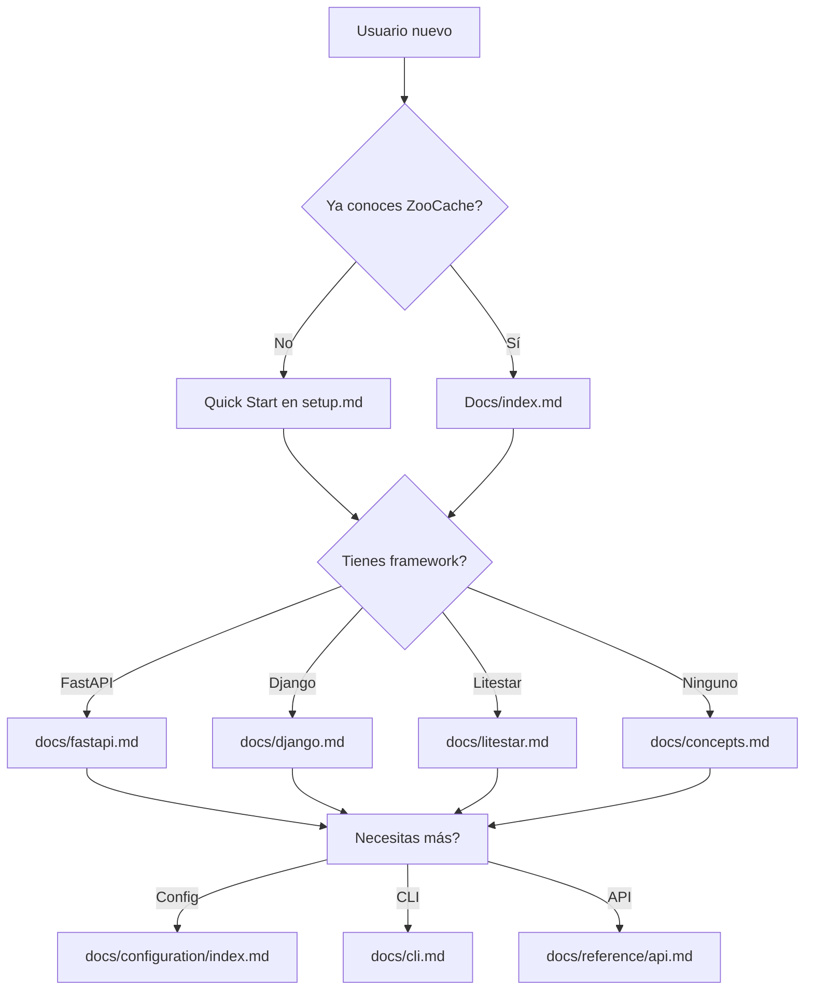

# Plan de Mejora de Documentación - ZooCache

## Estado Actual vs Estado Deseado

### 1. README.md - Arreglar enlaces rotos
- **Problema**: Enlace `docs/user_guide.md` no existe
- **Solución**: Cambiar a `docs/django_user_guide.md`
- **Agregar**: Pequeña sección "What's Next?" al final del Quick Start

---

### 2. docs/setup.md - Quick Start COMPLETO
**Actual**: 67 líneas, muy básico, NO menciona configure()

**Debe incluir**:
```markdown
# 🚀 Installation and First Steps

## Installation (repetir instalación básica)

## ⚡ Basic Setup (NUEVO - CRÍTICO)
Explicar configure() inmediatamente:
```python
from zoocache import configure

# Modo en memoria (más simple)
configure()

# O con Redis
configure(storage_url="redis://localhost:6379")
```

## Tu primera función cacheada
[Contenido actual pero mejorado]

## ⚙️ Configuración básica (NUEVO)
- TTL
- Prefijos
- Storage backends

## 🔄 Modo Distribuido (NUEVO)
- Enlace a distributed.md

## 📚 Siguientes pasos
- Si usas FastAPI → docs/fastapi.md
- Si usas Django → docs/django.md  
- Si necesitas CLI → docs/cli.md
- Para conceptos profundos → docs/concepts.md
```

---

### 3. docs/index.md - Landing page de ReadTheDocs

**Mejorar la estructura Diátaxis**:
```markdown
# ZooCache Documentation

## 🎯 Which guide is right for you?

| If you... | Start here |
|-----------|------------|
| Want to cache a simple function in 2 minutes | [Quick Start](setup.md) |
| Use FastAPI | [FastAPI Guide](fastapi.md) |
| Use Django | [Django Guide](django.md) |
| Want to understand concepts | [Core Concepts](concepts.md) |

## 🚀 Quick Start (reducido, links a setup.md)
Demo de 5 líneas que muestra el poder de la librería

## 📖 Explore by Topic
[Grid de tarjetas mejor organizado]
```

---

### 4. docs/django.md - Expandir

**Agregar**:
- Requisitos previos (instalar con extra)
- Configuración completa
- Ejemplo completo de modelo
- Explicación de invalidación automática
- Enlace al user guide detallado

---

### 5. docs/reference/api.md - Documentación real

**Opciones**:
1. Generar automáticamente con mkdocstrings (ya configurado pero no funciona)
2. Escribir documentación manual de las APIs principales

**APIs a documentar**:
- `configure()`
- `@cacheable`
- `invalidate()`
- `add_deps()`
- `cache_endpoint` (FastAPI)
- `ZooCacheManager` (Django)

---

### 6. Estructura de mkdocs.yml

**Mejorar navegación**:
```yaml
nav:
  - Home: index.md
  - 🚀 Getting Started:
      - Quick Start: setup.md
      - Your First Cache: tutorials/first-cache.md  # NUEVO
  - 🔌 Integrations:
      - FastAPI: fastapi.md
      - Django: django.md
      - Litestar: litestar.md
  - ⚙️ Configuration:
      - General: configuration/index.md
      - Storage: configuration/storage.md
  - 💡 Concepts:
      - Core Concepts: concepts.md
      - Invalidation: invalidation.md
      - Consistency: consistency.md
      - Serialization: serialization.md
  - 🛠️ How-to Guides:
      - CLI: cli.md
      - Telemetry: telemetry/index.md
  - 📚 Reference:
      - API: reference/api.md
```

---

### 7. Nuevos archivos a crear

1. **docs/tutorials/first-cache.md** - Tutorial paso a paso
   - Instalar
   - Configurar
   - Crear primera función cacheada
   - Invalidar
   - Ver resultado

2. **docs/tutorials/web-app.md** - Tutorial para web
   - Caso de uso completo con FastAPI o Django

---

## Prioridades de Implementación

### 🔴 Alta prioridad ( блокируют uso):
1. Arreglar enlace roto en README.md
2. Agregar `configure()` a setup.md
3. Expandir setup.md con configuración básica

### 🟡 Media prioridad:
4. Mejorar index.md
5. Expandir docs/django.md
6. Mejorar navegación mkdocs.yml

### 🟢 Baja prioridad:
7. Crear tutoriales nuevos
8. Mejorar API reference
9. Añadir más ejemplos

---

## Mermaid: Flujo de documentación propuesto



---

## Métricas de éxito

- [ ] Un nuevo usuario puede hacer funcionar un ejemplo básico en < 5 minutos
- [ ] Cada integraciones (FastAPI/Django/Litestar) tiene guía completa
- [ ] La estructura Diátaxis está correctamente implementada
- [ ] No hay enlaces rotos
- [ ] API reference tiene documentación útil
